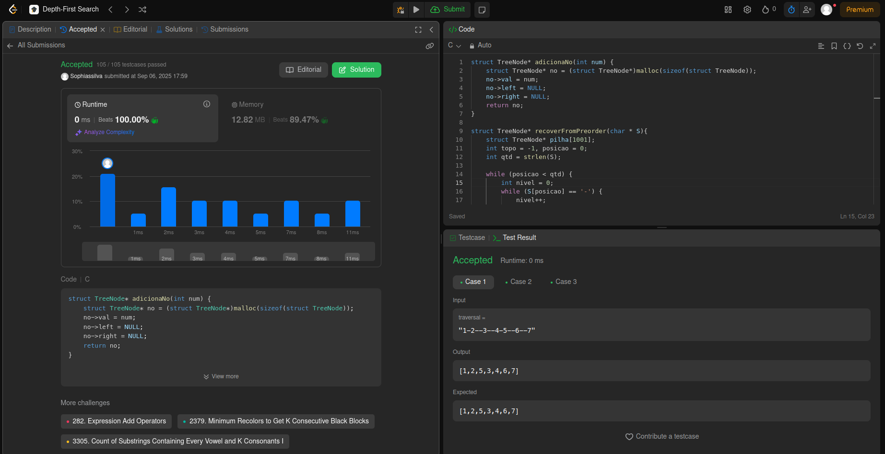
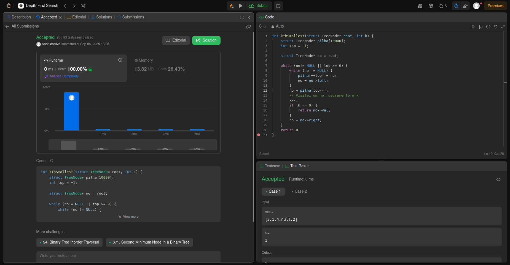

# Trabalho 1 - Grafos 1

**Número do trabalho:** 1  
**Conteúdo: Grafos 1**

## Alunas

| Matrícula |        Nome Completo       |
|:---------:|:-------------:|
| 190106034 | Esther Silva Cardoso de Sousa |
| 231026886 | Sophia Souza da Silva |

## Definição do Trabalho

Para este primeiro trabalho, decidimos resolver questões do leetcode.

## Linguagens utilizadas

Foi utilizado linguagem C e Python.

## Questões

| Questão | Nível  | Link do vídeo |
|---------|--------|------------------|
| [numero. Nome do exercio]() | Difícil | [Vídeo]() |
| [numero. Nome do exercio]() | Médio | [Vídeo]() |
| [1028. Recover a Tree From Preorder Traversal](https://leetcode.com/problems/recover-a-tree-from-preorder-traversal/description/?envType=problem-list-v2&envId=depth-first-search) | Difícil | [Vídeo]() |
| [230. Kth Smallest Element in a BST](https://leetcode.com/problems/kth-smallest-element-in-a-bst/description/?envType=problem-list-v2&envId=depth-first-search) | Médio | [Vídeo]() |

## Screenshots

### Exercício 01 

### Exercício 02 

### Exercício 03 - Recuperar árvore

### Exercício 04 - K-gésimo menor elemento

## Vídeo de apresentação do Trabalho 1
[Vídeo]()
